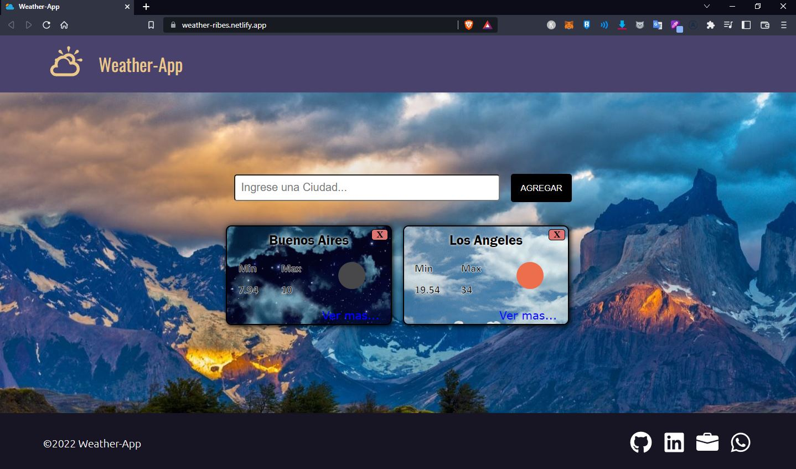

## Table of Contents
1. [General Info](#general-info)
2. [Technologies](#technologies)
3. [Installation](#installation)
3. [Screenshots](#Screenshots)
4. [Deploy](https://weather-ribes.netlify.app/)

### General Info
***

The development of this application has the purpose of knowing the climate of each country, this project was developed in the SoyHenry bootcamp, the OpenWeatherMap api was used

El desarrollo de esta aplicacion tiene como finalidad saber el clima de cada pais, este proyecto fue desarrollado en el bootcamp SoyHenry, se utilizo la api de OpenWeatherMap 

## Technologies
***
A list of technologies used within the project:
* Node: Version 16.13.0 
* React: Version 18.2.0
* Redux: Version 4.2.0
* React-Redux: Version 8.0.2

## Installation
***
A little intro about the installation. 
```
$ git clone https://github.com/rodri-ribes/countrys-app.git

./client
    $ npm install
    $ npm start
    
./api
    $ npm install
    $ npm run dev
```
### Screenshots
***

***
